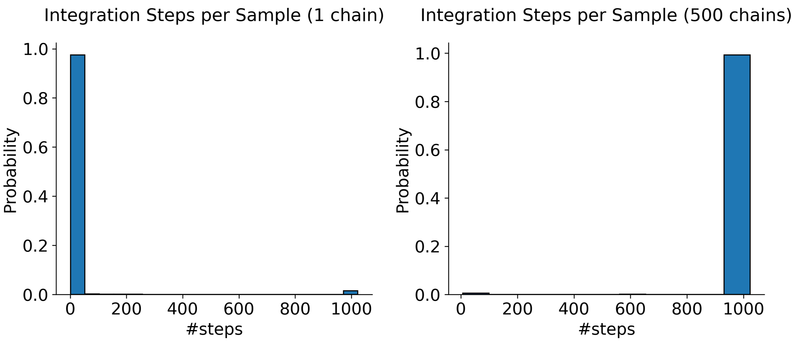

# JAX-FSM-MCMC: Vectorized MCMC without synchronization barriers

This repository contains JAX implementations of several stochastic-length proposal MCMC algorithms (i.e. HMC-NUTS and Slice sampling variants) for more efficient execution on SIMD architectures, when vectorizating with `vmap`. The implementation method is based on the paper "Efficiently Vectorized MCMC on Modern Accelerators" [https://www.arxiv.org/abs/2503.17405](https://www.arxiv.org/abs/2503.17405), which is accepted as a Spotlight at ICML 2025. 

### TL;DR

- **Issue:** Wrapping a data-dependent `while` loop in `jax.vmap` produces a single batched `While` operation with an aggregated termination condition for the whole batch, so each iteration stalls until **all** batch elements finish. For MCMC algorithms with such data-dependent while loops (e.g. NUTS, slice samplers), this creates a full-batch synchronization barrier at every sampling step, leading to inefficient vectorized execution.

  **Example:** LHS: The distribution of the number of integration steps needed by the No-U-Turn sampler (NUTS) [Hoffman and Gelman (2014)](https://www.jmlr.org/papers/volume15/hoffman14a/hoffman14a.pdf) on a high-dimensional correlated Gaussian Mixture. RHS: The distribution of the *maximum* number of integration steps needed across 500 chains to draw each sample (i.e. the distribution of the \# steps required when running 500 chains with `vmap`). The probability that a chain takes many $(>1000)$ steps is extremely small, but the probability that *at least **one*** chain needs $(>1000)$ steps is nearly one. When using `vmap` to run the chains, they will therefore all have to wait for $>1000$ loop iterations to draw each sample.

  
  

- **Solution:** We split the computation at each loop boundary into separate blocks $S_1,...,S_K$ which transition to one another based on the while loop terminators (see LHS figure below.). We use these blocks to define a `step` function which, given a current state $k$ and input variables $z = (x,\log p(x'),...)$, (i) checks the current MCMC algorithm block and (ii) uses `jax.lax.switch` or `jax.lax.cond` to dispatch the relevant block to update $z$. Starting from initialization $(z_0$,k=0), we use an outer wrapper to iteratively call `step` until the chain recovers its required samples. For vectorization, we just call `vmap(step)` instead of `step`, until all chains have collected their samples. `vmap(step)` lets each Markov chain progress through its own set of state sequences independently, eliminating the synchronization barrier.

 **Illustration:**
  **Back to The Example:** When we 

## Table of Contents

1. [Installation](#installation)  
2. [Getting Started](#getting-started)  
   - [Basic Usage](#basic-usage)  
3. [Reproducing Experiments](#reproducing-experiments)  
4. [License](#license)
5. [Citation](#citation)
6. [Contact](#contact)

## Installation

### 1. Prerequisites
requirements.txt

### 2. Clone and Install this repo

```bash
git clone https://github.com/hwdance/jax-fsm-mcmc.git
cd jax-fsm-mcmc
pip install -e .
```

### 3. Test Installation
```python
import jax_fsm_mcmc
print(jax_fsm_mcmc.__version__)
```

## Getting Started 
Below is a minimal example showing how to run a collection of NUTS chains using the FSM approach.


### Basic Usage 
 We jax, numpy, blackjax and the FSM machinery we will use to sample MCMC chains with NUTS.
 
```python
# Basic imports
import jax
import jax.numpy as jnp
import jax.random as jrnd
import numpy as np
import blackjax

# FSM imports
from FSM.mcmc.nuts_bundle import NutsFSM # NUTS algorithm in FSM form
from FSM.base.run_fsm_in import jitted_update # Jitted function to call blocks of the FSM
from FSM.base.run_fsm_in import get_fsm_samples_chain as get_fsm_samples # Outer wrapper to get n-samples per chain
```

We will implement NUTS to sample from the covariance hyperparameter posterior of a Gaussian process $f$, given data $(X_i,Y_i) \sim_{iid} P$ where $Y = f(X) + \xi : \xi \sim N(0,1)$. We start off by defining the log-posterior of the covariance hyperparameters $\tau,\eta, \sigma$. The likelihood is $p(y,X|\tau,\eta,\sigma) = N(y|0,K_{XX}(\tau,\eta) + I\sigma^2)$, where $[K_{XX}]_{i,j} = \tau \exp(-\frac{1}{2\eta^2}\|x_i-x_j\|^2)$, and we use standard Gaussian priors $\sigma,\eta,\tau \sim N(0,1)$.

```python
# Helper to create log likelihood for GPR
from FSM.utils.gpr import logpdf_gp_fn as get_logpdf_fn

# Generate data using linear model
def generate_linear_XY(key, n, x_min=-3.0, x_max=3.0):

    X = jnp.linspace(x_min, x_max, n)[:,None]
    key, subkey = jax.random.split(key)
    U = jax.random.normal(subkey, shape=(n,))
    Y = X + U

    return X, Y, key

key = jax.random.PRNGKey(42)
n_samples = 500
X, y, key = generate_linear_XY(key, n_samples, x_min=-3.0, x_max=3.0)

print("X shape:", X.shape)
print("Y shape:", y.shape)

# Define log-posterior of covariance hyperparameters
logprob_fn = jax.jit(get_logpdf_fn(y, X))

```

Now we set up the FSM. 


## Reproducing Experiments

## Citation
If you use JAX-FSM-MCMC or the accompanying ICML 2025 paper in your work, please cite it as:

```bibtex
@inproceedings{dance2025efficiently,
  title     = {Efficiently Vectorized MCMC on Modern Accelerators},
  author    = {Dance, H., Glaser, P., Orbanz, P. and Adams, R.P.},
  booktitle = {Proceedings of the 42nd International Conference on Machine Learning (iCML 2025)},
  year      = {2025},
  url       = {https://github.com/hwdance/jax-fsm-mcmc},
}
```

## License
This project is licensed under the Apache 2.0 License. See the LICENSE file for details.

## Contact
For questions or feedback, please contact:

Hugh W. Dance,
PhD Researcher, Machine Learning,
Gatsby Computational Neuroscience Unit, UCL
uctphwd@ucl.ac.uk


